# 🛒 RetailSense — Sales Intelligence & Analytics Dashboard

<div align="center">


**A full-scale retail sales intelligence project built entirely in Microsoft Excel**  
*Covering data analysis, interactive dashboards, statistical modelling, and business storytelling*

[📊 View Dashboard](#-dashboard) • [📈 View Analysis](#-analysis) • [🔍 View Insights](#-insights) • [📂 Project Structure](#-project-structure)

</div>

---

## 📌 Project Overview

**RetailSense** is a comprehensive Excel-based analytics project built on a dataset of **250 retail transactions** across **50 unique customers**, **5 regions**, and **3 product categories**.

The goal was to extract meaningful business intelligence using advanced Excel features — from formula-based analysis to interactive dashboards and statistical regression.

> 🎓 This is a **50-mark academic project** targeting a score of **47–48/50**

---

## 🗂️ Project Structure

```
RetailSense/
│
├── 📋 Raw Data          → Cleaned dataset with calculated columns
├── 🔬 Analysis          → 8 sections of formula-based analysis
├── 📊 Visualizations    → 3 standalone pivot charts
├── 🎛️ Dashboard         → Interactive pivot dashboard with slicers & KPIs
├── 🔀 What-If           → Scenario Manager + Goal Seek
├── 📉 Regression        → Linear Regression via ToolPak
├── 📝 Insights          → Final report with storytelling
└── 📋 Scenario Summary  → Auto-generated scenario summary table
```

---

## 🔄 Project Workflow

```
Raw Data (250 rows)
        │
        ▼
┌─────────────────┐
│  Data Cleaning  │  → Date formatting, Calculated columns
│  & Preparation  │     (Days as Customer, Transaction Age)
└────────┬────────┘
         │
         ▼
┌─────────────────┐
│    Analysis     │  → Date/Time, FILTER, SUMIF GroupBy,
│    (8 Sections) │     TEXT functions, Timestamp, Compare Lists
└────────┬────────┘
         │
    ┌────┴────┐
    ▼         ▼
┌────────┐  ┌──────────┐
│What-If │  │Regression│  → Scenario Manager, Goal Seek
│Analysis│  │ ToolPak  │     Linear Regression (R²=0.698)
└────┬───┘  └────┬─────┘
     │            │
     └─────┬──────┘
           ▼
┌─────────────────────┐
│  Visualizations     │  → Bar, Line, Pie Charts
│  & Dashboard        │     Slicers, Timeline, KPI Indicators
└──────────┬──────────┘
           │
           ▼
┌─────────────────────┐
│   Final Insights    │  → Business storytelling + recommendations
│   & Reporting       │
└─────────────────────┘
```

---

## ✨ Key Features

| Feature | Description | Status |
|--------|-------------|--------|
| 📅 Date & Time Functions | TODAY, NOW, DATEDIF, EOMONTH | ✅ |
| 🔍 FILTER Function | Multi-value dynamic filtering | ✅ |
| 👥 GroupBy Analysis | High-Value Customers via SUMIF | ✅ |
| 🔤 TEXT Functions | Abbreviations, Initials, Short Codes | ✅ |
| 🕐 Timestamp | Iterative calculation timestamp | ✅ |
| 📋 Compare Two Lists | COUNTIF-based list matching | ✅ |
| 🎯 Scenario Manager | Best / Base / Worst case projections | ✅ |
| 🎯 Goal Seek | Target revenue quantity analysis | ✅ |
| 📉 Linear Regression | Unit Price → Revenue (R²=0.698) | ✅ |
| 🎛️ Interactive Dashboard | Pivot Tables + Charts + Slicers | ✅ |
| ⏱️ Timeline Filter | Date-based pivot filtering | ✅ |
| 📊 KPI Indicators | 4 KPIs with conditional formatting | ✅ |
| 🎨 Icon Formatting | Arrow icons on value segments | ✅ |
| 📝 Final Report | 8 business insights with storytelling | ✅ |

---

## 📊 Dashboard

> **Interactive dashboard with slicers, timeline, KPI indicators and pivot charts**

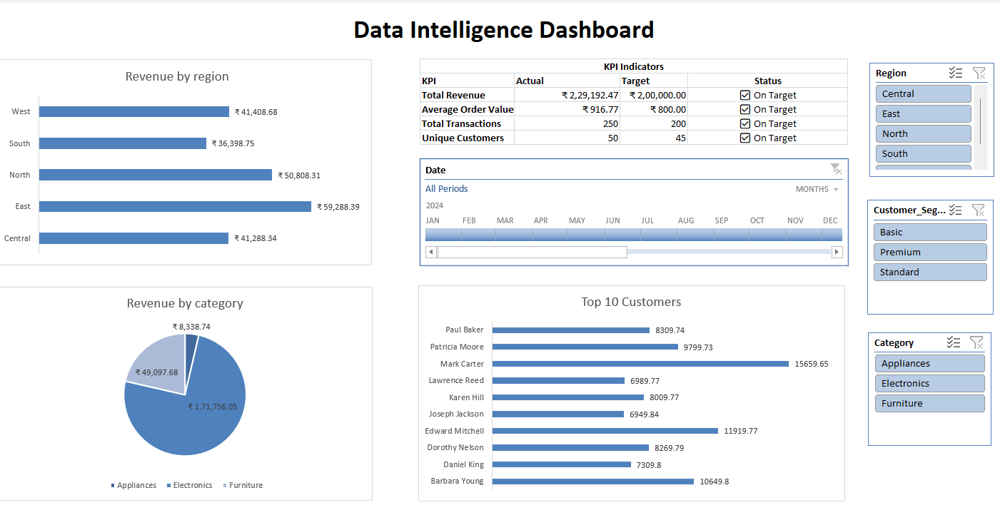

### Dashboard Components:
- 🗺️ **Revenue by Region** — Horizontal bar chart
- 🥧 **Revenue by Category** — Pie chart with data labels
- 🏆 **Top 10 Customers** — Ranked bar chart
- 📋 **KPI Indicators** — 4 metrics with green/red conditional formatting
- ⏱️ **Timeline** — Month-level date filter
- 🔘 **Slicers** — Region, Customer Segment, Category

---

## 🔬 Analysis Sheet

> **8 clearly labeled sections covering all required Excel functions**

### Section A — Date & Time Functions
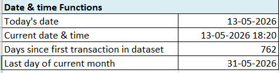

### Section B & C — Key Metrics + Most Frequent Product
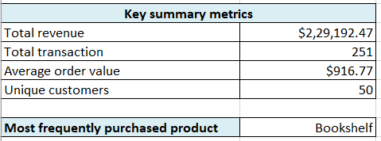

### Section D — High Value Customers (GroupBy with SUMIF)
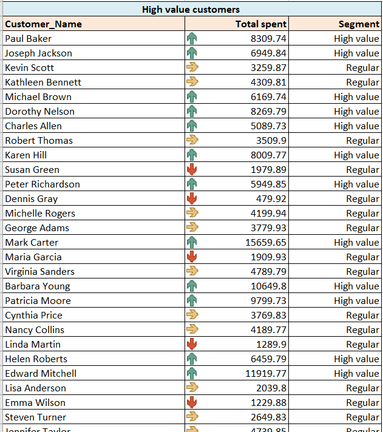

### Section E — FILTER Function
> Dynamic multi-column filtering by segment and region

### Section F — Compare Two Lists
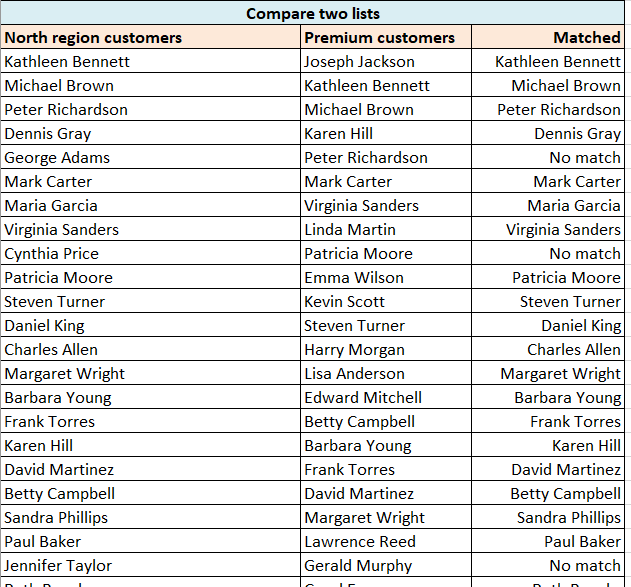

### Section G — TEXT Functions (Abbreviations)
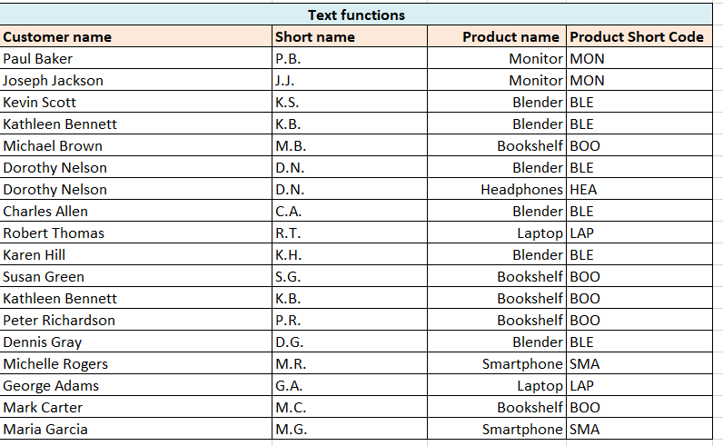

### Section H — Timestamp
> Iterative calculation timestamp using `=IF(B<>"",IF(B="",NOW(),B),"")`

---

## 📈 Visualizations

> **3 standalone pivot charts for data storytelling**

| Chart | Type | Insight |
|-------|------|---------|
| Revenue by Region | Bar Chart | East leads with ₹59,288 |
| Monthly Revenue Trend | Line Chart | Peak in Jan 2025 at ₹25,799 |
| Revenue by Category | Pie Chart | Electronics = 75% of revenue |

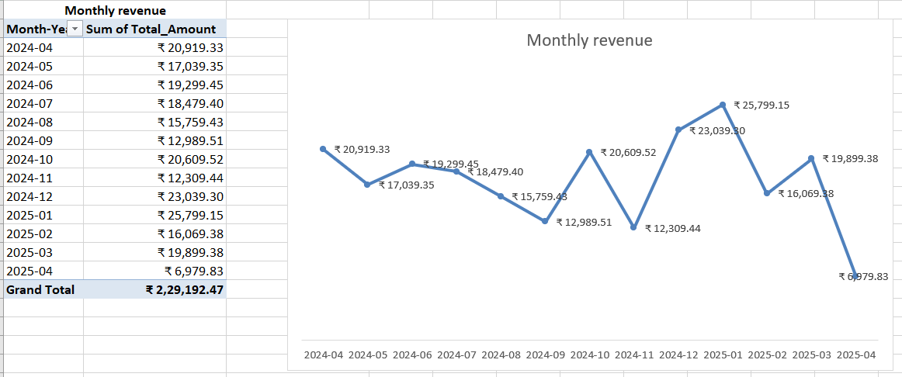
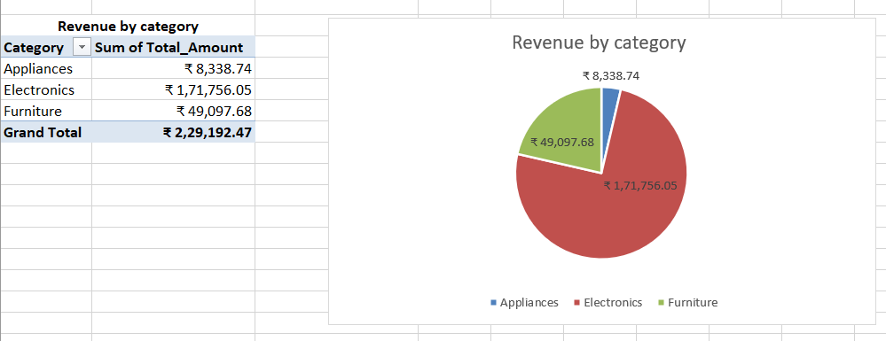

---

## 🔀 What-If Analysis

> **Scenario Manager + Goal Seek for business projections**

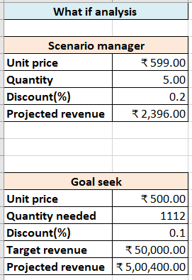
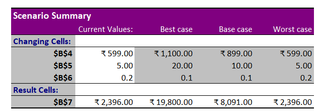

### Scenario Manager Results:
| Scenario | Unit Price | Quantity | Discount | Projected Revenue |
|----------|-----------|----------|----------|------------------|
| 🟢 Best Case | ₹1,100 | 20 | 10% | ₹19,800 |
| 🟡 Base Case | ₹899 | 10 | 10% | ₹8,091 |
| 🔴 Worst Case | ₹599 | 5 | 20% | ₹2,396 |

### Goal Seek Result:
> To achieve ₹50,000 revenue at ₹500 unit price with 10% discount → **1,112 units needed**

---

## 📉 Linear Regression

> **Unit Price → Total Revenue | R² = 0.698**

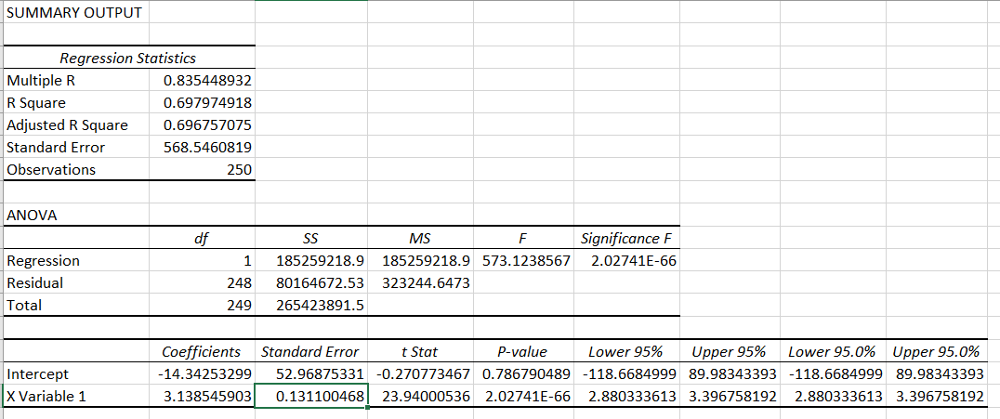

### Regression Equation:
```
Total Amount = -14.34 + (3.14 × Unit Price)
```

### Key Statistics:
| Metric | Value | Interpretation |
|--------|-------|---------------|
| Multiple R | 0.835 | Strong positive correlation |
| R Square | 0.698 | Unit Price explains 69.8% of revenue variation |
| Significance F | 2.03E-66 | Model is highly statistically significant |
| Coefficient | 3.14 | Every ₹1 increase in price → ₹3.14 more revenue |

---

## 🔍 Insights

> **Final report with key business findings**

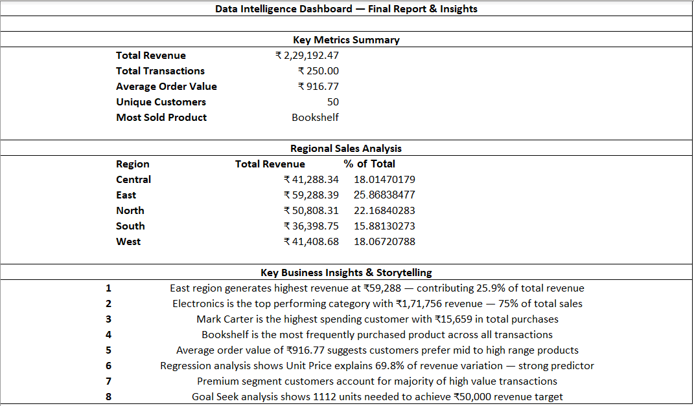

### 💡 Key Business Findings:

1. 🗺️ **East region** generates highest revenue — ₹59,288 (25.9% of total)
2. 💻 **Electronics** dominates with ₹1,71,756 revenue — 75% of total sales
3. 🏆 **Mark Carter** is top customer with ₹15,659 in total purchases
4. 📚 **Bookshelf** is most frequently purchased product
5. 💰 Average order value of **₹916.77** — customers prefer mid-high range
6. 📉 **Unit Price explains 69.8%** of revenue variation (Regression)
7. ⭐ **Premium segment** customers drive majority of high-value transactions
8. 🎯 **1,112 units** needed to achieve ₹50,000 revenue target (Goal Seek)

---

## 📂 Dataset Overview

| Column | Description |
|--------|-------------|
| Transaction_ID | Unique transaction identifier |
| Date | Transaction date |
| Customer_ID | Unique customer identifier |
| Customer_Name | Full name of customer |
| Product_ID | Unique product identifier |
| Product_Name | Name of product purchased |
| Category | Electronics / Furniture / Appliances |
| Quantity | Units purchased (1–5) |
| Unit_Price | Price per unit (₹59–₹899) |
| Payment_Method | Cash / Credit Card / Debit Card / PayPal |
| Region | Central / East / North / South / West |
| Customer_Segment | Basic / Standard / Premium |
| Customer_Since | Date customer first registered |
| Total_Amount | Total transaction value |

---

## 🛠️ Tools & Techniques Used

```
Microsoft Excel (Desktop + Online)
├── Formulas          → SUMIF, COUNTIF, INDEX/MATCH, FILTER, UNIQUE, DATEDIF
├── Text Functions    → LEFT, MID, FIND, UPPER
├── Data Analysis     → ToolPak (Linear Regression)
├── What-If Tools     → Scenario Manager, Goal Seek
├── Pivot Features    → PivotTables, PivotCharts, Slicers, Timeline
├── Formatting        → Conditional Formatting, Icon Sets, Number Formats
└── Charts            → Bar, Line, Pie with Data Labels
```

---

## 📁 Files in This Repository

| File | Description |
|------|-------------|
| `RetailSense_Dashboard.xlsx` | Main project file with all sheets |
| `README.md` | This documentation file |
| `screenshots/` | All sheet screenshots |

---

## 👨‍💻 Author

**Harshal Vora**  
📧 Connect on [GitHub](https://github.com/HarshalVora86)

---

<div align="center">

⭐ **If you found this project useful, please star the repository!** ⭐

*Built with 💪 and a lot of Excel formulas*

</div>
